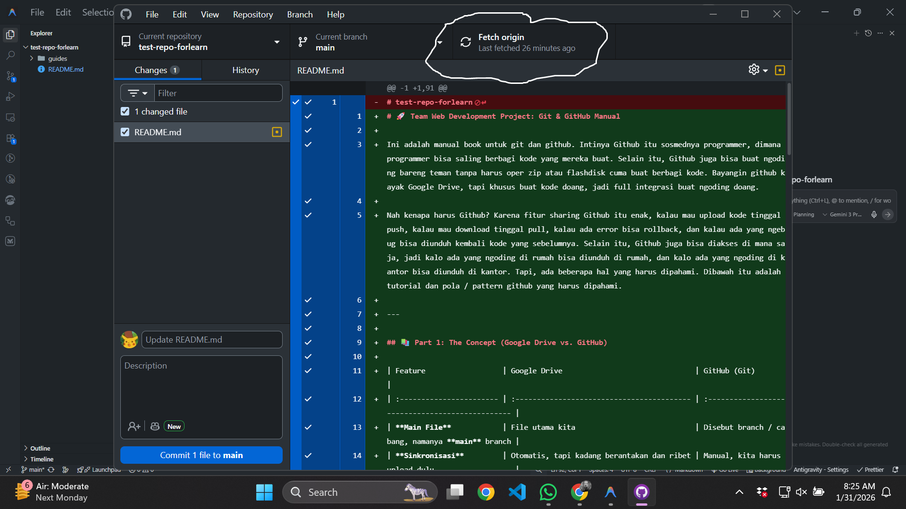
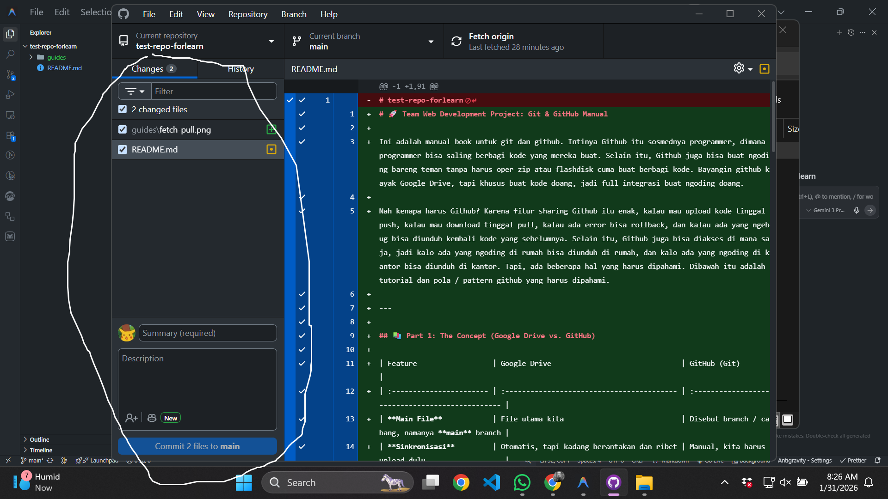
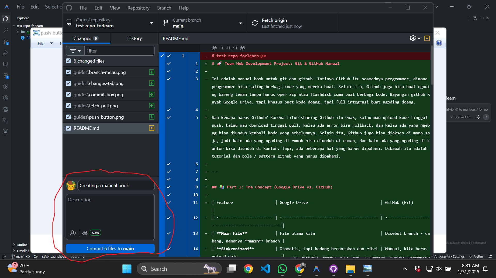
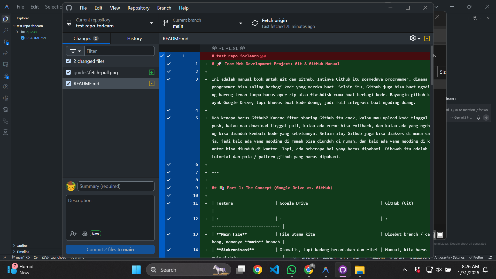
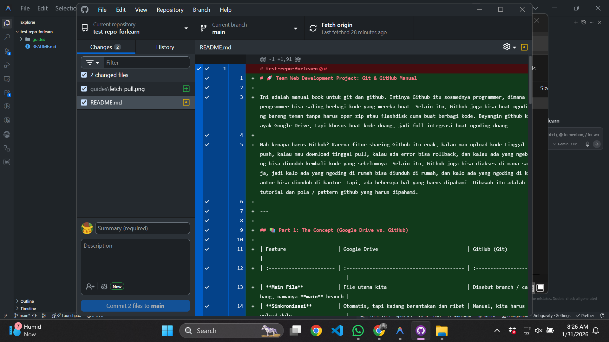

# 🚀 Team Web Development Project: Git & GitHub Manual

Ini adalah manual book untuk git dan github. Intinya Github itu sosmednya programmer, dimana programmer bisa saling berbagi kode yang mereka buat. Selain itu, Github juga bisa buat ngoding bareng teman tanpa harus oper zip atau flashdisk cuma buat berbagi kode. Bayangin github kayak Google Drive, tapi khusus buat kode doang, jadi full integrasi buat ngoding doang.

Nah kenapa harus Github? Karena fitur sharing Github itu enak, kalau mau upload kode tinggal push, kalau mau download tinggal pull, kalau ada error bisa rollback, dan kalau ada yang ngebug bisa diunduh kembali kode yang sebelumnya. Selain itu, Github juga bisa diakses di mana saja, jadi kalo ada yang ngoding di rumah bisa diunduh di rumah, dan kalo ada yang ngoding di kantor bisa diunduh di kantor. Tapi, ada beberapa hal yang harus dipahami. Dibawah itu adalah tutorial dan pola / pattern github yang harus dipahami.

---

## 📚 Part 1: The Concept (Google Drive vs. GitHub)

| Feature                  | Google Drive                               | GitHub (Git)                                     |
| :----------------------- | :----------------------------------------- | :----------------------------------------------- |
| **Main File**            | File utama kita                            | Disebut branch / cabang, namanya **main** branch |
| **Sinkronisasi**         | Otomatis, tapi kadang berantakan dan ribet | Manual, kita harus upload dulu                   |
| **Buat copy / duplikat** | "Klik kanan -> Make a copy"                | Buat **Branch** sendiri buat kita sendiri        |
| **Version History**      | Liat di Revision history                   | **History** tab (Commit log)                     |

Kalau dilihat diatas, kelihatannya ribet banget. Contohnya kenapa kalau mau sinkronisasi kerjaan harus manual? Karena kalau ada dua orang mengerjakan 1 file yang sama, kalau sistemnya otomatis buyar semua. Kalau manual, kita bisa atur kapan mau sinkronisasi kerjaan kita, entah satu orang ngalah nunggu lainnya upload baru kita implementasikan fitur kita, dsb.

Konsep branch sendiri itu kayak kita bikin duplikat file, tapi duplikatnya itu terhubung sama file aslinya. Jadi kalau kita ngedit duplikatnya, file aslinya gak akan berubah. Kalau kita udah selesai ngedit duplikatnya, kita bisa gabungin duplikatnya sama file aslinya. Tapi, yang jelas ini tidak menjustifikasi untuk dua orang ngedit file yang sama di waktu yang sama. Lebih baik komunikasikan dulu mau ngedit apa, baru implementasikan fitur kita masing-masing.

---

## 🛠️ Part 2: Daily Workflow (Save dan Sinkron)

Ini adalah pola / pattern yang harus diikuti setiap kali mau ngoding. Pastikan selalu melakukan pattern ini, biar nanti manajemen kerjaan kita gak berantakan, dan reponya nggak conflict terus.

### Step 1: 📥 Get Latest Updates (Refresh)

Sebelum ngerjain sesuatu, **TOLONG PASTIKAN PULL DULU**, mau baru buka laptop kek, baru buka github kek, pastikan Pull dulu. Jangan sampai ada yang ngoding tanpa pull, nanti kerjaan kita buyar. Ini biar memastikan kode yang kita kerjain itu versi terbaru, biar nggak ada masalah "loh kok beda ya"

- Click **"Fetch origin"** at the top. Kalau ada perubahan, click **"Pull origin"**.

### Step 2: ✅ Tambahkan perubahan (Add)

Kalau udah selesai ngoding, jangan lupa tambahkan perubahan yang udah kamu buat. Biar nanti github tau perubahan apa aja yang udah kamu buat.

- Liat di tab **"Changes"** terus centang file yang udah kamu selesaiin.

### Step 3: 🏷️ Tambahin judul perubahan (Commit)

Kasih judul perubahannya guys, jangan sampai kosong, atau saking malesnya ngetik "bismillah bisa" atau "adgsjgd", "asdfghjkl", dsb. Kasih judul yang jelas, biar nanti kalo ada yang mau rollback, tau perubahan apa aja yang udah kamu buat.

- Ketik judul perubahan di kotak yang tersedia, terus klik **"Commit"**.

### Step 4: ☁️ Upload perubahan ke Github (Push)

Ini adalah proses upload perubahan yang udah kamu buat ke github. Biar nanti github tau perubahan apa aja yang udah kamu buat.

- Klik tombol **"Push origin"** di bagian atas.

---

## 🌳 Part 3: Main aman, kerja di cabang (The "Draft" Copy)

Pas ngoding enak enak, mau push, tiba tiba rusak. Buyar kan? Nah biar nggak buyar, kita kerja di cabang sendiri. Kayak kita bikin duplikat file, tapi duplikatnya itu terhubung sama file aslinya. Jadi kalau kita ngedit duplikatnya, file aslinya gak akan berubah. Kalau kita udah selesai ngedit duplikatnya, kita bisa gabungin duplikatnya sama file aslinya. Ini juga biar melacak siapa ngerjain apa, biar orang tersebut bertanggung jawab atas kerjaannya, dan biar nggak ada conflict.

1. Click **"Current Branch"** (tengah atas) -> **"New Branch"**.
2. Kasih nama cabang sesuai kerjaan kamu (contoh: `feature-header-design`) dan click **"Create Branch"**.
3. Click **"Publish Branch"** untuk membagikan cabang kamu ke tim.
4. Kalau udah selesai ngoding, click **"Create Pull Request"** untuk meminta Ketua menggabungkan cabang kamu ke main repo.

---

## 📜 Part 4: Protokol / Peraturan Tim (Kitab panduan buat kerjasama tim,)

Hukumnya **WAJIB FARDHU AIN**, lebih baik nurutin ini daripada kerjaan seminggu hilang semua.

1. **JANGAN PERNAH KERJA DI MAIN:** Jangan pernah ngedit di `main` branch. Buat **Branch** sendiri, **KECUALI** dalam keadaan terpaksa harus ketika kerja kelompok offline biar kita sama sama tahu dan bisa bantu langsung.
2. **Tolong Pull Dulu:** Pastikan "Fetch/Pull" sebagai kebiasaan di pagi hari, dan setiap baru nyalain komputer atau baru buka github/editor. Ini biar memastikan kode yang kita kerjain itu versi terbaru, biar nggak ada masalah "loh kok beda ya".
3. **Sering sering commit:** Walau cuma ngerjain satu tombol, kalau udah stuck, commit aja dulu. Lebih gampang benerin satu tombol daripada satu halaman rusak gara gara nggak commit 3 hari berturut-turut.
4. **Komunikasi:** Selalu buka WA. Ngoding di laptop = pasti buka WA desktop. Di cek terus notifikasi grup. Kalau mau ngedit apa, bilang. Jangan diam aja. Komunikasi itu jalan biar kita bisa lulus dua matkul ini, bukan cuma lulus doang, tapi dapet nilai bagus.
5. **🚨 ATURAN PALING PENTING:** Kalau ada error atau **"Merge Conflict"** ingat: **STOP, PLEASE STOP.** Jangan mencet apa apa lagi. Screenshot, kirim ke grup. Satu kesalahan fatal, buyar. Iya kalau yang buyar satu halaman doang. Kalau 1 fitur? 1 Project? 1 Semester? Please jangan ngapa-apain tanpa diskusi.

---

## 🚨 Kalau rusak / ada kesalahan gimana bang?

- **Aduh, salah edit file:** Klik kanan filenya di bagian "Changes" -> **Discard Changes**. Ini menghapus perubahan yang udah kamu buat, jadi pastikan kamu udah nyimpen di tempat lain.
- **Terlanjur commit jir:** Click tombol **Undo** di bagian bawah kiri. Ini kayak rollback, tapi cuma bisa satu kali. CTRL + Z lah istilahnya.
- **Aduh rusak, balik ke versi sebelumnya dong:** Buka tab **History**, klik kanan save an yang kamu mau, terus pilih **Revert Changes**. Ini baru rollback, tapi ini juga bisa bikin conflict kalau ada yang udah ngedit di atasnya. Jadi mending diskusi dulu.
